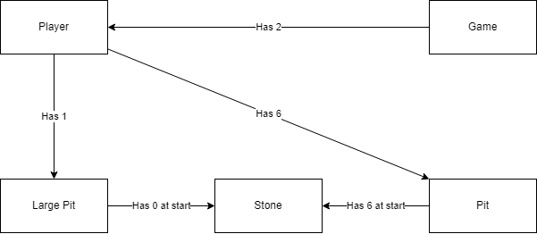
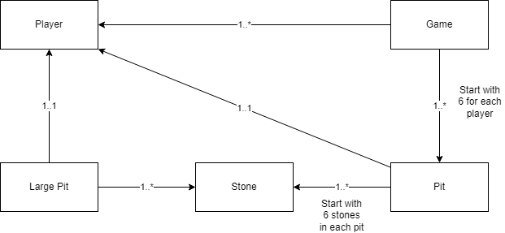

# Mancala (WIP)

Play Mancala a fun, simple game with rocks and a special board with cups. (It used to be played on the ground, with little holes in the dirt.)

## How it started

I started with a domain model and relational model of the game:





## Chosen technologies

- Front-end framework
  - Vue 3
    - composition API nudges devs into creating better code grouping around features
- State management
  - Pinia
    - wanted to use something different than Vuex
- Realtime communication
  - ~~WebRTC~~
    - didn't get the DataChannel working fast enough
  - WebSockets (socket.io)
- Webserver
  - Express
- Testing
  - ~~ViteTest~~
    - didn't really have time to set it up

## What's currently here?

- Basic board UI and game rules
- Result of the game is logged to console
- Uses Pinia for state management
- WebSocket "chat" (WIP)
  - Needs to be hooked up to turnEnded event to communicate moves
  - Just logs messages to console

## What will I focus on next?

I'd focus on the multiplayer (WebSocket) part first and improving the UI after that.
Adding Unit Tests for a project with this little "business logic" doesn't feel like the best use of development time.
If the application has some bigger API's with different software like an SDK or WebApi than it would definitely be a priority.

## Starting

### Compile and Hot-Reload for Development

```sh
npm run dev
```

### Run WebSocket server

```sh
npm run serve
```

### Run Unit Tests with [Vitest](https://vitest.dev/)

```sh
npm run test:unit
```

